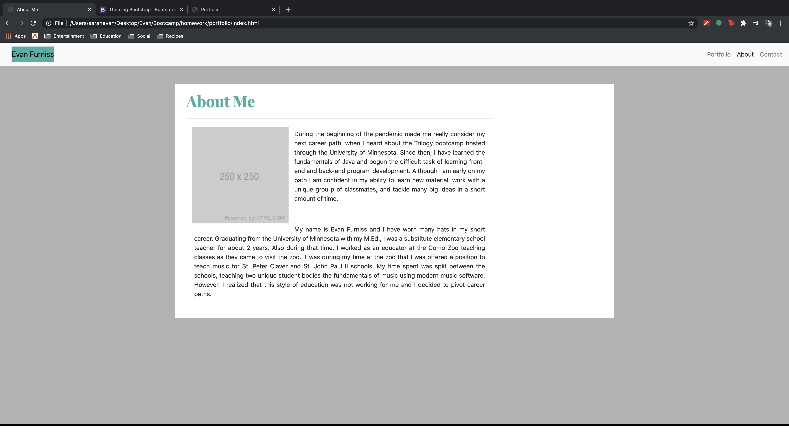
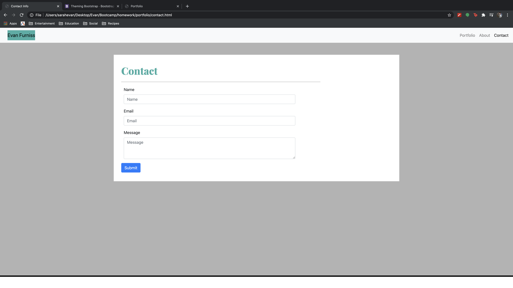
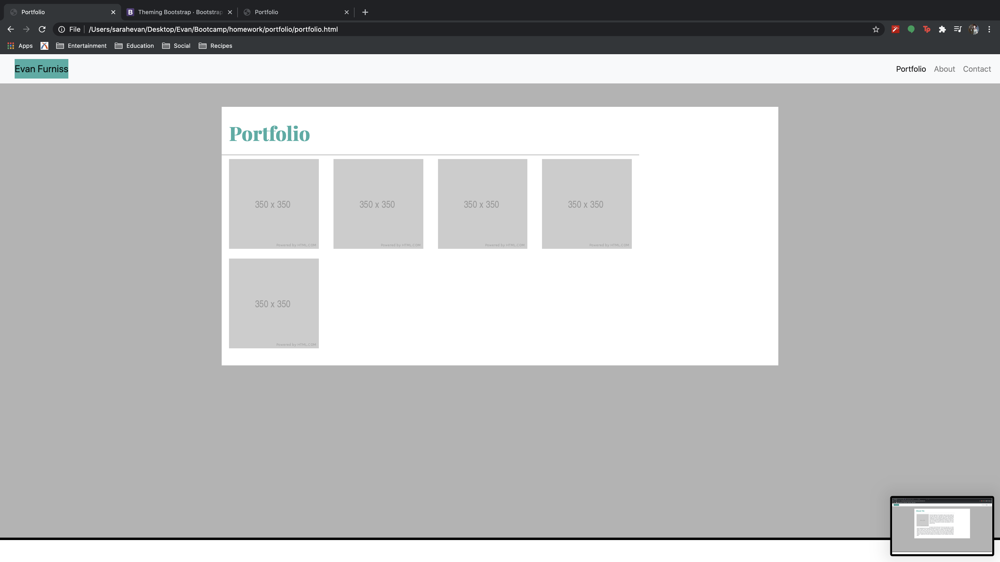

# Responsive Portfolio

## Overview
I created a portfolio page, built from the ground up using HTML, CSS, and assistance from Bootstrap. With these tools, I was able to create a responsive style portfolio. It currently has 3 pages; an about me, a contact page, and a portfolio page of my past projects. 

I had a very hard time initially with integrating bootstrap. After some help from an associate, Kieran, I was able to create a portfolio where I will add past, current, and future projects in an easy to navigate page. The fundamentals of HTML and CSS had been a challenge. With Kieran's assistance I feel far more confident with these technologies. Bootstrap was helpful in creating different sections to my webpage. In the future I hope to completely rehaul my webpage to allow my personal CSS flavor to come throuh.

Future content that will be available on my active page will include links to my previous work, a more personalized about me page, and a contact link that will allow users to send me an email.

## Acknowledgements
I used Bootstrap version 4.5.3 while creating the portfolio framework.

I also utilized Google fonts for my h1 sections.

## GitHub repo link and active link
https://github.com/evanfurniss/responsive-portfolio

https://evanfurniss.github.io/responsive-portfolio/index.html

## Preview images

